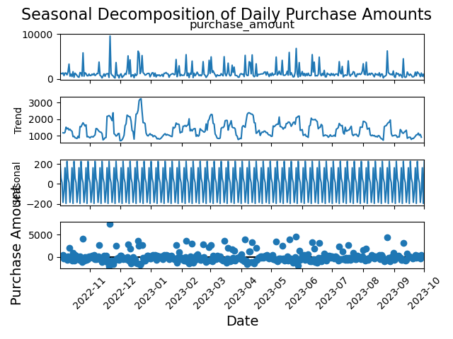

# 🛍️ Fashion Retail Analytics: Demand Forecasting & Seasonal Analysis

## 1. Project Overview

This project analyzes over 3,400 transaction records from a fashion retailer to uncover sales patterns, forecast future demand, and provide actionable, data-driven recommendations. The primary goal is to leverage historical data to optimize inventory, marketing efforts, and overall business strategy.

The project involves a full data analysis lifecycle:
* **Data Cleaning & Preprocessing:** Handling missing values through strategic imputation.
* **Exploratory Data Analysis (EDA):** Building an interactive Tableau dashboard to identify key business trends.
* **Time Series Analysis:** Decomposing sales data to understand underlying seasonality and trends.
* **Predictive Modeling:** Building and evaluating a SARIMA model to forecast future sales.

---

## 2. The Business Problem & Objectives

A fashion retailer wants to move from reactive decision-making to a proactive, data-informed strategy. They need to understand their sales patterns better to optimize stock levels, plan marketing campaigns effectively, and maximize revenue.

The key business objectives were:
-   **Identify Peak Sales Periods:** Determine which days of the week, months, and seasons drive the most revenue.
-   **Understand Customer Behavior:** Analyze payment preferences and product popularity.
-   **Test for Cross-Selling Opportunities:** Investigate if customers frequently purchase multiple items together.
-   **Forecast Future Demand:** Predict future sales volume to improve inventory management and resource planning.

---

## 3. Data Cleaning and Preparation

The initial dataset contained significant missing values in two critical columns: `Purchase Amount (USD)` and `Review Rating`.

-   **Challenge:** Dropping these rows would have meant losing nearly 20% of the data, potentially biasing the analysis.
-   **Solution:** I used a **median imputation strategy grouped by `Item Purchased`**. This involved calculating the median price and rating for each unique fashion item and using those specific medians to fill the missing values. This approach is more accurate than using a single global median and preserves the integrity of the dataset.
-   **Additional Steps:** The `Date Purchase` column was converted to a `datetime` object to enable time-series analysis.

---

## 4. Key Findings & Analysis

### Finding 1: Weekends and End-of-Week are Prime Selling Periods
- **Analysis:** EDA in Tableau and Python revealed that sales consistently peak towards the end of the week, with **Friday and Saturday** being the highest-performing days for both transaction volume and revenue.
- **Business Insight:** Marketing efforts and promotions should be concentrated on Thursdays and Fridays to capture this existing customer momentum.

### Finding 2: Customers are Primarily Single-Item Shoppers
- **Analysis:** I attempted to perform a **Market Basket Analysis** to identify cross-selling opportunities. However, the analysis revealed that the average transaction size (or "basket") was only **1.03 items**.
- **Business Insight:** This was a critical finding. The data shows that the current business model is driven by single-item purchases, not multi-item baskets. This means cross-selling is not a primary driver of revenue, and marketing should focus on promoting individual hero products.

### Finding 3: Clear Weekly and Monthly Seasonality
- **Analysis:** Using `statsmodels`, I decomposed the daily sales data. The analysis showed a clear **7-day weekly cycle** and a noticeable **monthly pattern**, with sales often increasing in the latter half of the month.
- **Business Insight:** This predictable rhythm allows for better inventory planning. For example, stock levels for popular items should be highest leading into the peak weekends and the second half of each month.

---

## 5. Sales Forecasting with SARIMA

A **SARIMA (Seasonal AutoRegressive Integrated Moving Average)** model was built to forecast future daily sales.

-   **Implementation:** The model was trained on the first 80% of the historical sales data and evaluated on the remaining 20%. The model's parameters were tuned to account for the weekly seasonality discovered during the time-series analysis.
-   **Outcome:** The model successfully captured the underlying sales pattern and produced a reliable forecast, providing the business with a quantitative tool to anticipate future sales volume.

---

## 6. Recommendations for the Business

Based on the analysis, I propose the following actionable recommendations:

1.  **Optimize Marketing Spend:** Shift promotional budgets to **Thursdays and Fridays** to maximize impact during the natural peak sales window.
2.  **Focus on "Hero Products," Not Bundles:** Since customers typically buy single items, marketing campaigns should focus on promoting individual best-selling products rather than complex multi-buy offers.
3.  **Implement Data-Driven Inventory Management:** Use the demand forecast and seasonal insights to ensure popular items are well-stocked ahead of peak periods (weekends, end-of-month) to avoid stockouts and lost revenue.

---

## 7. Tools & Technologies

-   **Data Manipulation & Analysis:** Python, Pandas
-   **Time Series Analysis & Forecasting:** `statsmodels` (for seasonal decomposition and SARIMA)
-   **Data Visualization & Dashboards:** Tableau, Matplotlib, Seaborn## 🔧 Tools & Technologies

| Tool       | Purpose                            |
|------------|-------------------------------------|
| Python 🐍   | Data cleaning & preprocessing       |
| Pandas     | Aggregations and feature creation   |
| Tableau 📈 | Interactive dashboards and charts   |
| Matplotlib / Seaborn | Early-stage visual EDA     |

---

## 📈 Sample Visuals



> **Friday consistently outperforms all other days** in both revenue and transaction count. Promotions could be focused on Thursdays and Fridays to capture momentum.

---


## 🗂 Folder Structure

├── data/
│ └── raw_retail_data.csv
├── notebooks/
│ └── retail_eda.ipynb
├── assets/
│ └── sample_dashboard.png
├── dashboards/
│ └── tableau_public_link.twbx
├── README.md


---

## 📎 How to Reproduce

1. Clone the repository:
```bash
git clone https://github.com/paakaer/fashion-retail-dashboard.git
```
2. Open the Jupyter notebook under /notebooks to follow the data wrangling steps.

3. Open the Tableau .twbx file in Tableau Desktop or view on [Tableau Public](https://public.tableau.com/views/FashionRetailSales_17543152118940/main?:language=en-GB&publish=yes&:sid=&:redirect=auth&:display_count=n&:origin=viz_share_link).
